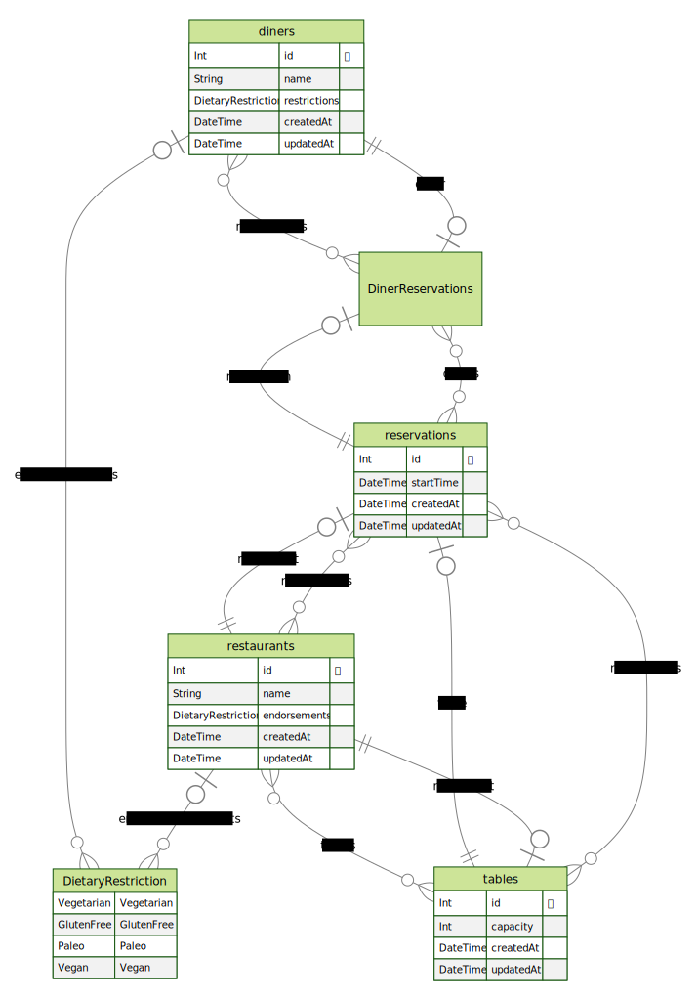

# Diner Reservations

Hello! This is a quick and dirty implementation of an appointment scheduling
system for diners in Node.js.

## Running

- Make sure you have docker installed.
- Run `docker-compose up` to start the db and app server.

## Project Structure

- Application code for the API layer is in `src/api/app`.
- Data model and related utilities are in `src/db`.

## API Layer

Two endpoints were added to simulate the desired functionality:

- `GET /restaurants`: Search API for available restaurants
- `POST /reservations`: Create Reservation API subject to validation

### API Specs

See the specs in [docs/](/docs/) for usage and testing notes:

- [diners](docs/outputs/diners.pdf)
- [restaurants](docs/outputs/restaurants.pdf)
- [reservations](docs/outputs/reservations.pdf)

## Data Model

